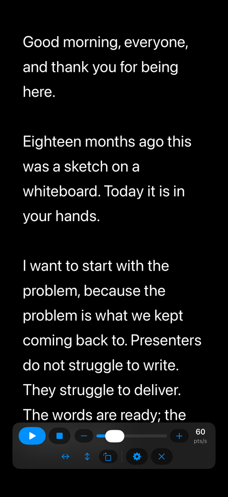
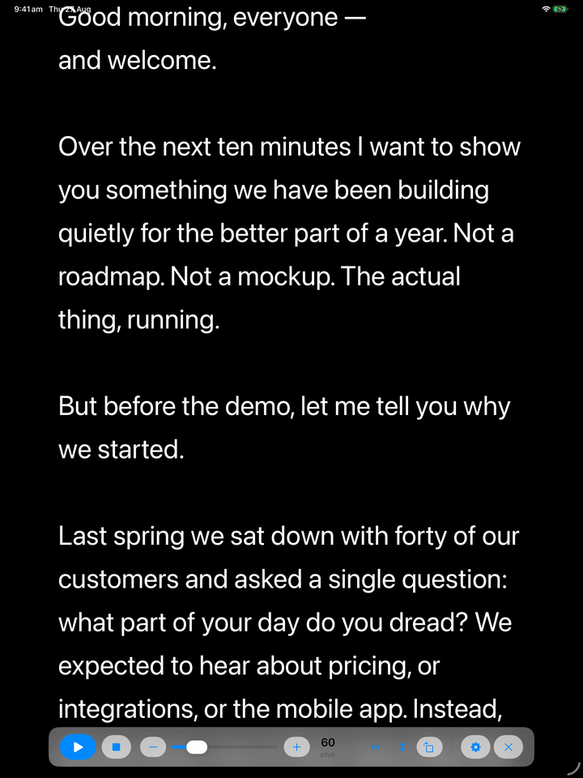
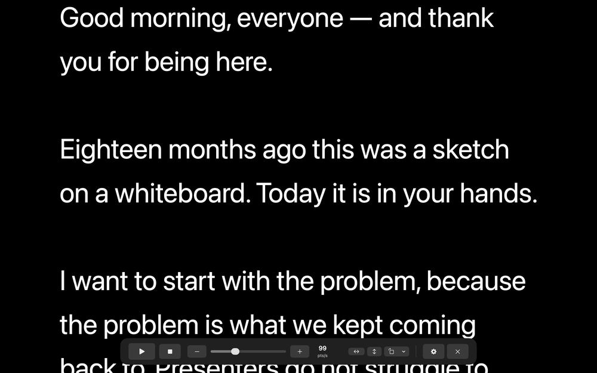
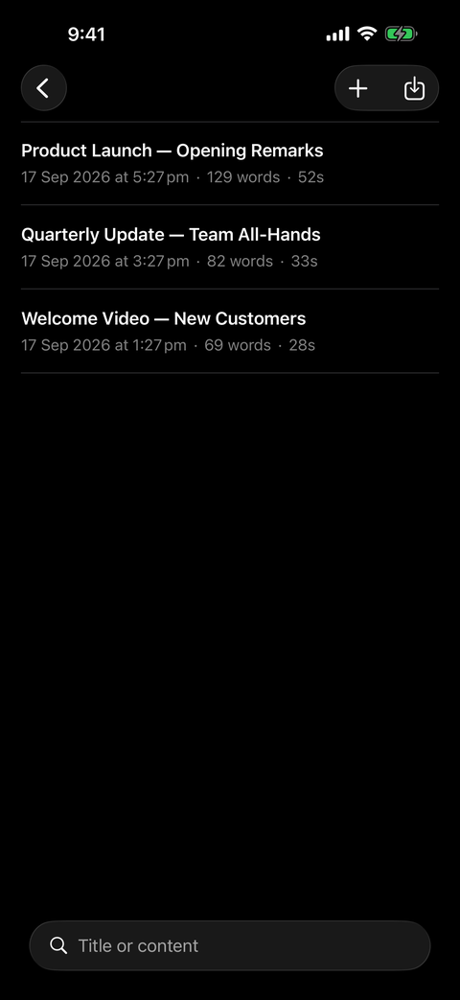
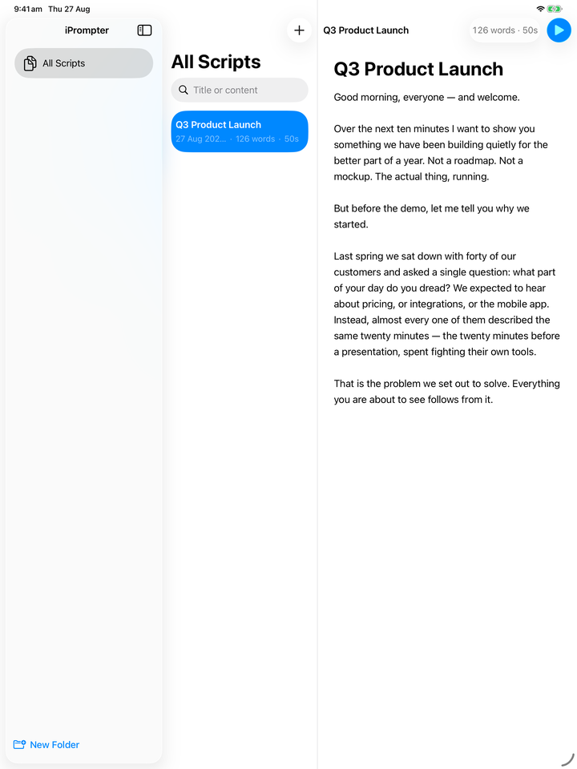
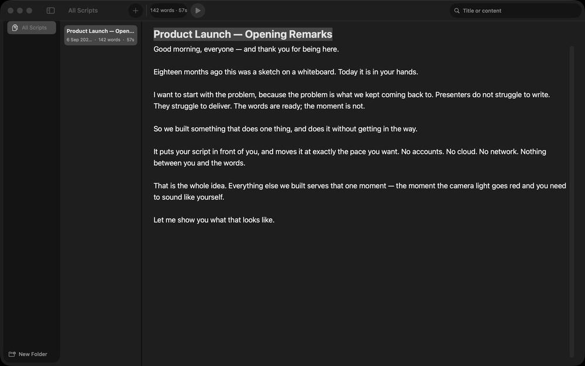

# eTeleprompter

**A distraction-free teleprompter for iPhone, iPad and Mac.**

Write or import a script, put your device on a mirror rig or read straight from the screen, and scroll it at a speed you control to the point per second. Mirror and rotation modes are built for teleprompter glass. No accounts, no cloud, no network — your scripts never leave your device.

<a href="https://apps.apple.com/app/id6805915935"></a>

Free on the App Store for iPhone, iPad and Mac. Made by [Hung Ngo](https://hungngo.net).

## What it does

- **Steady, precise scrolling** — 10 to 300 points per second, adjustable by slider, ±10 buttons or arrow keys, with every change eased over a third of a second so the text never jumps. Playback stops itself at the end.
- **Built for mirror rigs** — flip horizontally, vertically, or rotate to any right angle, in any combination, live during playback. The controls stay the right way round.
- **A reading view that suits your eyes** — five typefaces, 20–120 pt, adjustable spacing and margins, eight text and background colours.
- **Import from PDF and Word** — bring in a `.pdf` or `.docx` as a new script, or into one you already have (`.doc` on the Mac too).
- **Scripts, organised** — named folders, search across titles and content, live word count and reading time. Every edit saves itself.
- **Keyboard control** — Space to play/pause, ↑↓ for speed, Esc to exit.

## Screenshots

<table>
  <tr>
    <th align="center">iPhone</th>
    <th align="center">iPad</th>
    <th align="center">Mac</th>
  </tr>
  <tr>
    <td align="center" valign="top"></td>
    <td align="center" valign="top"></td>
    <td align="center" valign="top"></td>
  </tr>
  <tr>
    <td align="center" valign="top"></td>
    <td align="center" valign="top"></td>
    <td align="center" valign="top"></td>
  </tr>
</table>

The reading view is the whole point: the control bar hides itself after two seconds of playback and comes back with a tap (or a mouse move on the Mac), so nothing sits between you and the words.

---

## For developers

The rest of this document covers building from source.

## Requirements

- **Xcode 26 or later**
- **iOS deployment:** iOS / iPadOS 17 or later (iPhone and iPad)
- **macOS deployment:** macOS 14 or later
- **Project generation:** eTeleprompter is generated from `project.yml` using XcodeGen. The `eTeleprompter.xcodeproj` file is generated; never edit it directly. Instead, add or remove Swift files under `eTeleprompter/` or `eTeleprompterTests/` folders, and Xcode automatically picks them up via synchronized folders.

### Signing (only needed to run on a physical device)

Simulator and macOS builds use ad-hoc signing and need no setup. To install on a
real iPhone or iPad, supply your own Apple Developer Team ID — it is intentionally not in
this repo, since it identifies a specific developer account:

```bash
cp Config/Signing.local.xcconfig.example Config/Signing.local.xcconfig
# then edit it: DEVELOPMENT_TEAM = YOURTEAMID
```

`Config/Signing.local.xcconfig` is gitignored and pulled in automatically by
`Config/Signing.xcconfig`. Alternatively pass `DEVELOPMENT_TEAM=YOURTEAMID` on
the `xcodebuild` command line, or just select your team in Xcode under
**Signing & Capabilities**.

## Build and Run

Run these from the repo root:

### Build for iPad Simulator
```bash
xcodebuild -project eTeleprompter.xcodeproj -scheme eTeleprompter \
  -destination 'generic/platform=iOS Simulator' build CODE_SIGNING_ALLOWED=NO
```

### Build for macOS
```bash
xcodebuild -project eTeleprompter.xcodeproj -scheme eTeleprompter \
  -destination 'platform=macOS' build CODE_SIGNING_ALLOWED=NO
```

### Run on iPad Simulator (interactive)
```bash
# Boot simulator (example: iPad Pro 13-inch M4)
xcrun simctl boot "iPad Pro 13-inch (M4)" || true
open -a Simulator

# Build and install
xcodebuild -project eTeleprompter.xcodeproj -scheme eTeleprompter \
  -destination 'platform=iOS Simulator,name=iPad Pro 13-inch (M4)' \
  build CODE_SIGNING_ALLOWED=NO

# Launch app
xcrun simctl launch booted com.iprompter.iPrompter
```

### Run on macOS (interactive)
```bash
# Build with ad-hoc signing so it launches
xcodebuild -project eTeleprompter.xcodeproj -scheme eTeleprompter \
  -destination 'platform=macOS' build

# Launch the app
open ~/Library/Developer/Xcode/DerivedData/eTeleprompter-*/Build/Products/Debug/eTeleprompter.app
```

### Unit Tests
```bash
xcodebuild -project eTeleprompter.xcodeproj -scheme eTeleprompter \
  -destination 'platform=macOS' test CODE_SIGNING_ALLOWED=NO
```

## Features

### 1. Script Library
- **Create:** Tap "+" to create a new script titled "Untitled"; the editor opens immediately for you to add content. The script is auto-saved.
- **Edit:** All title and content edits auto-save; there is no Save button. Last-modified date updates on every change.
- **Search:** Type to search scripts by title and content (case-insensitive substring matching). Results filter the current list live.
- **Organize:** Create flat, single-level folders in the sidebar. Scripts belong to one folder or no folder. When a folder is deleted, its scripts are kept and appear under "All Scripts."
- **Duplicate:** Context-menu action copies a script with identical content and auto-generates a unique title (`Demo copy`, `Demo copy 2`, etc.).
- **Delete:** Swipe (iPad) or context menu (both platforms) to delete with confirmation. Deletion is permanent.
- **Sorting:** Scripts are sorted by last-modified date descending (newest first), fixed. Folders sort alphabetically in the sidebar.

### 2. Smooth Scrolling Engine
- **Transport:** Play, Pause (position retained), Resume, Stop (return to top). The script opens paused at the beginning.
- **Speed Control:** Speed is measured and displayed in points/second (pts/s). Range is 10–300 pts/s, default 60. Adjust via on-screen slider (continuous, snaps to integers), −/+ buttons (step 10 pts/s), or keyboard (↑/↓ keys for ±10 pts/s).
- **Speed Ramp:** Every speed change and play/pause transition smoothly interpolates the actual scroll rate over 0.3 seconds—no sudden jumps, just a gentle acceleration or deceleration.
- **Auto-Stop:** Playback automatically stops when the text reaches the end and shows the control overlay again.
- **Performance:** 60+ FPS even on 10,000-word scripts at maximum font size, with no visible stutter or jitter.

### 3. Customizable Reading View
- **Styling:** Adjust font family (SF Pro, New York, Helvetica Neue, Georgia, Menlo), size (20–120 pt), line spacing (1.0–2.0 multiplier), and margins (0–25% symmetric).
- **Colors:** Choose text and background from 8 preset colors each (no custom color picker). Defaults are white text on black (industry-standard for mirror rigs).
- **Settings Panel:** Tap the gear icon in the control overlay. Closes with Done or a tap outside.
- **Persistence:** All reading settings are global (not per-script) and survive app relaunches.

### 4. Mirror Mode
- **Transforms:** Three independent toggles—horizontal mirror (flip left-right), vertical flip (flip upside-down), and rotation (0°/90°/180°/270°). Any combination works; transforms apply to the reading text only.
- **Readable Controls:** The control overlay, speed readout, and settings interface are never mirrored or rotated. Only the text you read through the mirror is transformed.
- **Live Toggle:** Switch mirror settings during playback with no interruption; scrolling continues smoothly.
- **Persistence:** Mirror, flip, rotation, and speed settings survive app relaunches.

### 5. Keyboard Shortcuts (Hardware Keyboard)
All shortcuts work on both iPad (with hardware keyboard) and macOS:

| Key | Action |
|-----|--------|
| **Space** | Toggle play/pause |
| **↑** (Up Arrow) | Increase speed by 10 pts/s |
| **↓** (Down Arrow) | Decrease speed by 10 pts/s |
| **Esc** | Exit prompter, return to editor |

**macOS:** The Playback menu in the menu bar mirrors these shortcuts (Play/Pause ⎵, Faster ↑, Slower ↓, Exit Esc). Menu items are enabled only while the prompter is active.

## Architecture

**MVVM with SwiftData:** Models (Script, Folder) are SwiftData `@Model` classes with built-in persistence and SwiftUI `@Query` integration. Views are lightweight and bind to model objects directly.

**PrompterEngine (UI-Independent):** The scrolling engine imports only Foundation and Observation—no SwiftUI, UIKit, or AppKit. This makes it:
- Fully unit-testable without a display link
- Ready for future voice-tracking integration
- Observable by views that drive it with frame-clock ticks

The production frame clock (`DisplayLinkClock`) wraps CADisplayLink on iOS and NSScreen.displayLink (macOS 14+) for 60 FPS rendering. Tests use a manual clock to verify ramp timing and speed clamping deterministically.

**Settings Persistence:** A single `ReadingSettings` struct (font, size, spacing, margins, colors, mirror/flip/rotation, speed) is encoded to JSON and stored by `SettingsStore` in `UserDefaults` under the single `"readingSettings"` key, keyed by color ID strings to survive palette changes.

## Project Structure

```
eTeleprompter/
  App/                   Entry point, root navigation, app state
    eTeleprompterApp.swift   Main app, scene, model container, menu commands
    RootView.swift       Navigation shell (sidebar/list/editor + prompter overlay)
    AppState.swift       Observable state for prompter presentation
    SidebarItem.swift    Enum for sidebar selection (all scripts or folder)

  Models/                SwiftData data models
    Script.swift         Script with title, content, dates, folder relationship
    Folder.swift         Folder with name and inverse scripts relationship

  Engine/                UI-independent scrolling engine
    PrompterEngine.swift State machine, speed ramping, auto-stop logic
    PrompterClock.swift  Protocol for frame-clock injection

  Settings/              Global settings persistence
    ReadingSettings.swift Font, size, spacing, margins, colors, mirror, speed
    PresetPalette.swift  8-swatch color palette
    SettingsStore.swift  UserDefaults wrapper with JSON encoding

  Features/
    Library/             Script browser (WP2)
      SidebarView.swift          Folder list, "All Scripts", new folder UI
      ScriptListView.swift       Scripts filtered by sidebar selection
      ScriptRowView.swift        Script title, date, word/reading-time display
      FolderRowView.swift        Folder name and context menu
      DuplicateNamer.swift       Finder-style "copy" naming
      MoveToFolderMenu.swift     Context menu for script folder assignment

    Editor/              Script editor (WP3)
      EditorView.swift           Title field, content editor, word count toolbar
      ReadingTimeFormatter.swift "Xm Ys" format helper (e.g., "4m 30s")

    Prompter/            Full-screen reading view (WP5)
      PrompterView.swift         Main prompter UI, auto-hide controls, gestures,
                                 plus TouchInterceptor (platform view for
                                 hit-testing and macOS key handling)
      PrompterTextBlock.swift    Chunked text rendering (24 lines per chunk)
      MirrorContainer.swift      Mirror/flip/rotation transforms on text only
      PrompterControlsView.swift Play/Pause, Stop, speed slider, ±/readout, gear
      PrompterSettingsSheet.swift Font/color/spacing/mirror settings popup
      DisplayLinkClock.swift     CADisplayLink (iOS) / NSScreen.displayLink (macOS)
      PrompterCommands.swift     macOS Playback menu commands
      PresetColor+Color.swift    Color palette integration

eTeleprompterTests/
  PrompterEngineTests.swift  22 unit tests: state machine, speed clamping, ramping, auto-stop
  ReadingSettingsTests.swift 10 unit tests: settings encoding/decoding, persistence
```

All files under `eTeleprompter/` and `eTeleprompterTests/` are automatically tracked by Xcode (synchronized folders); there is no need to manually add them to the project.

## Testing

The app includes **32 unit tests** covering:

- **Engine state machine:** play → paused → stopped, with position retention
- **Speed clamping:** never below 10 or above 300 pts/s via any control
- **Speed ramping:** linear interpolation over 0.3 s on every speed change and play/pause
- **Auto-stop:** offset stays at content height; offset resets on stop
- **Settings persistence:** read/write round-trip through JSON encoding to UserDefaults

Run with:
```bash
xcodebuild -project eTeleprompter.xcodeproj -scheme eTeleprompter \
  -destination 'platform=macOS' test CODE_SIGNING_ALLOWED=NO
```

The engine is tested with a manual clock (`ManualClock` in the test target) that delivers fixed frame deltas, so assertions are deterministic and independent of real frame timing.

## Known Limitations

- **macOS physical-keyboard verification:** Space and Esc shortcuts are verified by code inspection only; a manual keyboard test is recommended before release to rule out any remaining keyboard-event routing edge cases.
- **3-second auto-hide:** The control overlay hides 3 seconds after the last interaction during playback. This is the design per the spec, but may feel aggressive in practice; consider this a candidate for product refinement.
- **Hardware iPad keyboard:** The simulator MCP cannot inject hardware key events to the iPad simulator, so Space/↑/↓ shortcuts were verified on macOS only. The key bindings in code are correct; physical iPad testing is recommended.

## Out of Scope (Post-MVP)

The following are intentionally not building in this release:
- Voice tracking (future integration point for the UI-independent engine)
- Camera recording
- Cloud sync / iCloud integration
- AI features
- Screen brightness control
- Import/export of scripts
- Per-script settings (reading view settings are global)
- Undo history beyond the system text-field undo
- Rich text or Markdown rendering
- Nested folders, custom sort, tags, or remote control

## License

MIT — see [LICENSE](LICENSE).

Built by [Hung Ngo](https://hungngo.net) · [hungngo.net](https://hungngo.net)
